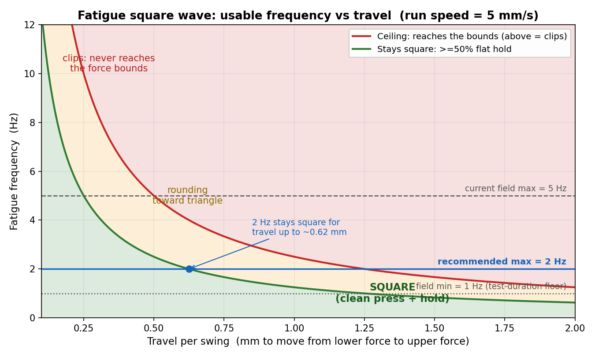

# Fatigue Frequency Limits — why and how much

**Recommended field limits:** Frequency = **1 Hz (min) to 2 Hz (max)**, whole numbers.
*(Today the field allows 1–5 Hz. The 5 Hz ceiling is optimistic — see below.)*

---

## The short version

A fatigue square wave presses the actuator between a lower and an upper force and back, over
and over. Two different things govern it:

- **Frequency** (Hz) — how many press→release cycles happen per second. *The knob the operator sets.*
- **Actuator speed** (mm/s) — how fast the rod physically moves. *A fixed capability, not a setting in the fatigue test.*

If the operator asks for more cycles per second than the rod can physically travel down-and-up
in time, the press never reaches the bounds or never holds flat — it rounds into a triangle and
then shrinks in amplitude. So **frequency must be bounded by what the speed allows.**

## Empirical square-wave characterization (measured sweep) — for the sensor team

The theory further down estimates the square-wave ceiling from speed alone. A measured
frequency sweep on the rig (`tools/zaber_square_wave_characterization.py`) tells the real
story, and it is **much lower**: the actuator only reproduces a faithful square wave up to
**~0.25 Hz** (Jacqueline's sweep).

- **~0.25 Hz** — usable square-wave limit: the wave still reaches its bounds and holds roughly flat.
- **0.5 Hz** — the waveform already deviates significantly (edges round off, the flats shrink).
- **1 Hz** — clearly not a square any more.

**Deviation metric.** For each swept frequency the tool drives the commanded square wave and
logs the achieved position, then reports the **RMS error between achieved and commanded
position, as a percent of the commanded amplitude** (0% = a perfect square; higher = more
rounded / more lag). The "usable limit" is the fastest frequency whose deviation stays within
the limit *and* still reaches its bounds. The sweep is dense below 0.5 Hz (0.1, 0.15, 0.2,
0.25 … 0.5 Hz) so the knee near 0.25 Hz is well resolved. Output graph:
`zaber_characterization/characterization_curve.svg` (deviation + amplitude fidelity + tracking
lag vs frequency, with the usable limit marked).

**Why it's lower than the speed-only math below.** The `V/(4·D)` estimate assumes the rod
reaches full speed instantly. In reality the edges are limited by acceleration, command/serial
latency, and settling, which dominate the short travels of a square wave — so the measured
square-wave limit lands far below the naive speed ceiling.

**What this means for the sensor team.** A fatigue test can still *cycle* the sample above
0.25 Hz, but the shape becomes a rounded / triangular wave, not a square. If a true square is
required, keep the frequency at or below ~0.25 Hz. If a rounded cycle is acceptable, the
higher fatigue field limits below still apply. Next step: rerun the sweep on the rig for more
points between 0 and 0.5 Hz, save the graph, and send it with this deviation definition to the
sensor team.

## The speed that actually matters

The fatigue loop uses **two different speeds**, which is easy to confuse:

| Phase | Speed | Source |
|---|---|---|
| Calibration probe (one slow press to find the depth range) | **1.0 mm/s** | `REAL_CYC_DESCEND_MM_S` |
| **The actual run** (tracking the waveform) | **≈5 mm/s** | the Zaber's `maxspeed` setting — `axis.move_absolute(..., wait_until_idle=False)` with no velocity arg |

So the speed that limits the square shape **during a run is the Zaber `maxspeed` (~5 mm/s)**, *not*
the 1.0 mm/s calibration probe. Confirm the exact value from the startup log line:
`[calibration] Zaber default move speed (maxspeed): X mm/s`.

## The math

Let `V` = run speed (mm/s) and `D` = travel per swing (mm to move from the lower-force position to
the upper-force position — this depends on the sample's stiffness).

- Time to ramp one edge: `t_ramp = D / V`
- **Ceiling** (above it the press can't even reach the bounds): `f = V / (2·D)`
- **Stays square** (hold is ≥50% of each half-cycle): `f ≤ V / (4·D)`

At `V = 5 mm/s`:

| Travel per swing `D` | Reaches bounds up to | Stays *square* up to |
|---|---|---|
| 0.2 mm (very stiff) | 12.5 Hz | 6.25 Hz |
| 0.5 mm | 5 Hz | 2.5 Hz |
| 0.6 mm | 4.2 Hz | 2.1 Hz |
| 1.0 mm | 2.5 Hz | 1.25 Hz |
| 2.0 mm (soft) | 1.25 Hz | 0.6 Hz |

## Why these limits

- **Min = 1 Hz** — *not* a squareness limit (lower frequency is always squarer). It's a
  **test-duration floor**: the default 28,800-cycle test runs 8 h at 1 Hz, and longer below it.
- **Max = 2 Hz** — at the 5 mm/s run speed, 2 Hz still renders a clean square for travels up to
  **~0.6 mm**, which covers a moderately stiff contact with margin for control-loop overhead.
  The current 5 Hz max only stays square for travel ≤ ~0.25 mm (a very stiff sample) and clips
  for anything softer.

If the samples under test are reliably very stiff (travel < ~0.25 mm), the max can safely go higher
— read it off the green curve for the measured travel.

## A better long-term option (optional)

The run **already measures the travel live** during calibration (`got_shallow` → `got_deep` in
`_run_cyclical`). So instead of a fixed cap, the backend could compute `V / (4·D)` from the measured
travel at the start of each run and **warn or clamp** if the chosen frequency is too high for that
specific sample. That makes the limit exact per sample instead of a conservative guess.

## What changes if we adopt 1–2 Hz

- `web_preview/js/fatigue.js` — Frequency field min/max + the snap message ("Frequency must be a
  whole number between 1 and 2 Hz").
- Feature 1.11.5 #1 spec (test-plan doc + user-stories doc) — "1 to 5 Hz" → "1 to 2 Hz".
